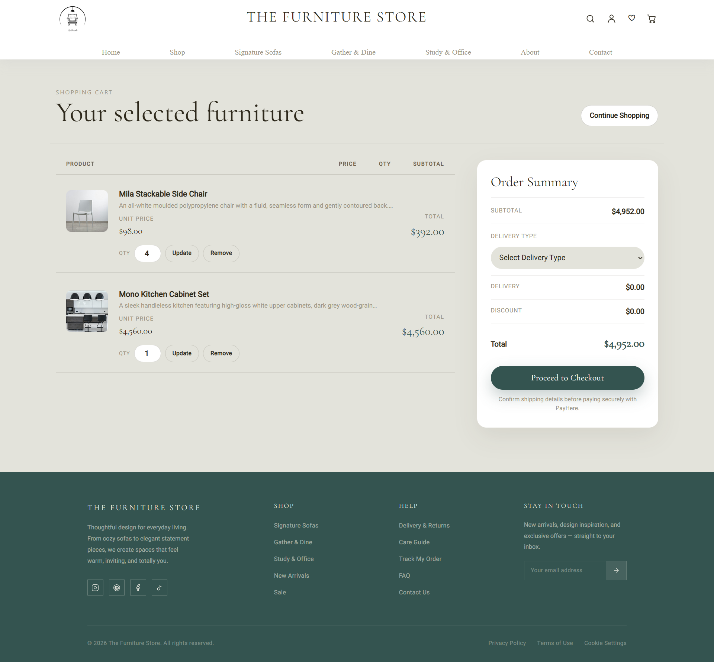
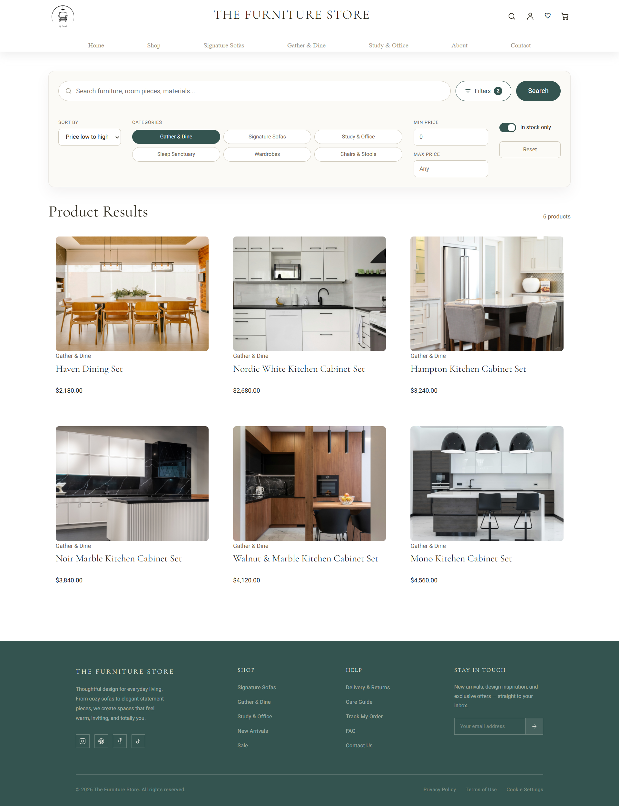
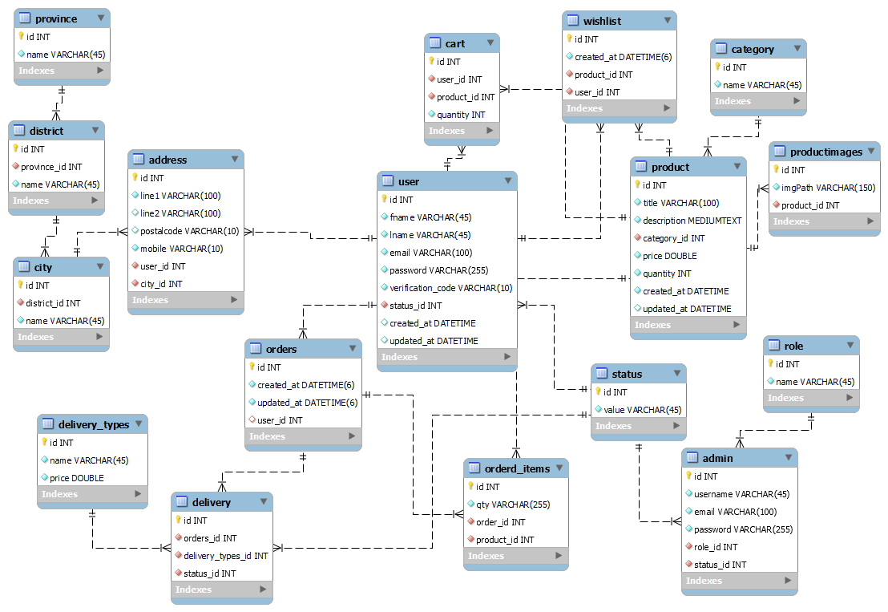

# The Furniture Store

A Java 11 furniture e-commerce application with a Jersey REST API, Hibernate ORM, MySQL, and an embedded Tomcat server. It supports a customer storefront and an administrator workspace for catalog, order, user, and reporting tasks.

## Highlights

### Customer experience

- Account registration, email verification, login, logout, password reset, and optional secure remember-me login
- Product browsing by category and product-detail pages
- Advanced search with keywords, multiple categories, price range, availability filter, saved preferences, and pagination
- Shopping cart with quantity updates and removal
- Wishlist management
- Checkout and PayHere payment integration
- Order tracking, cancellation, profile management, and delivery-address management

### Administration

- Admin-only authentication and route protection
- Dashboard, product and category management, user and admin management, and order-status updates
- Product image uploads with type, size, and image-count validation
- Inventory monitoring with a low-stock report
- Sales-by-category report, CSV export, and pricing insight report

### Engineering and security

- RESTful JSON API built with Jersey (JAX-RS)
- Hibernate ORM using HQL, Criteria API, joins, aggregate projections, and subqueries
- BCrypt password hashing, legacy-password migration on successful login, and signed HTTP-only remember-me cookies
- Environment-based secrets: database, mail, PayHere, and cookie settings stay out of source control
- Centralized JSON server-error handling plus custom 404 and 500 pages
- JUnit 5 unit tests and documented manual test cases

## Technology stack

| Technology | Purpose | Version |
|---|---|---|
| Java | Application language | 11 |
| Jersey (JAX-RS) | REST API | 3.1.2 |
| Hibernate ORM | Persistence and queries | 6.1.7.Final |
| MySQL Connector/J | Database driver | 9.0.0 |
| Embedded Tomcat | Web server | 10.1.7 |
| Jakarta Servlet | Web API | 6.0.0 |
| Gson | JSON serialization | 2.10.1 |
| Jakarta Mail | Email support | 2.0.x |
| jBCrypt | Password hashing | 0.4 |
| JUnit Jupiter | Automated tests | 5.10.2 |
| Maven Wrapper | Build and test tooling | Included |

## Screenshots

### Customer storefront

| Home | Shop |
|---|---|
|  |  |

| Product details | Shopping cart |
|---|---|
|  |  |

| Search | Customer profile |
|---|---|
|  |  |

### Administration workspace

| Dashboard | Product management |
|---|---|
|  |  |

| Order management | Reports |
|---|---|
|  |  |

### Data model

<<<<<<< HEAD

=======

>>>>>>> f3c9fb15a10bcf0e51f29a784e0bca02ec987893

## Prerequisites

- JDK 11 or newer
- MySQL 8 or compatible MySQL server
- IntelliJ IDEA (recommended) or another Java IDE

## Local setup

1. Clone the repository and open it as a Maven project.
2. Create a local environment file from the safe template:

   ```powershell
   Copy-Item .env.example .env
   ```

3. Update `.env` with your local MySQL, SMTP, PayHere, and remember-me values. Do not commit this file.
4. Create the database and load the supplied schema:

   ```powershell
   mysql -u <database_user> -p < database/schema.sql
   ```

5. Build and run the tests:

   ```powershell
   .\mvnw.cmd test
   .\mvnw.cmd package
   ```

6. Run `lk.thefurniturestore.Main` from your IDE. Then open:

   ```text
   http://localhost:8080/thefurniturestore/
   ```

The application reads values from `.env` for local development. Operating-system environment variables take precedence and are recommended for deployment.

## Configuration

| Variable | Purpose |
|---|---|
| `DB_URL` | JDBC connection URL |
| `DB_USERNAME` / `DB_PASSWORD` | MySQL credentials |
| `MAIL_HOST`, `MAIL_PORT`, `MAIL_USERNAME`, `MAIL_PASSWORD`, `APP_MAIL` | Outbound email settings |
| `PAYHERE_MERCHANT_ID` / `PAYHERE_MERCHANT_SECRET` | PayHere credentials |
| `APP_REMEMBER_ME_SECRET` | Long random secret used to sign remember-me cookies |

Use `.env.example` as the complete template. Keep production secrets in your deployment environment or secret manager.

## Project documentation

- [Database schema](database/schema.sql)
- [Entity-relationship diagram](database/erd.md)
- [Manual test cases](testing/manual-test-cases.md)
- [Navigation structure diagram](docs/appendices/Figure%204.2%20Navigation%20Structure.png)
- [Order and delivery workflow](docs/appendices/Figure%204.3%20Order%20and%20Delivery%20Workflow.png)

## Build output

`mvn package` produces the WAR artifact in `target/`. The embedded-server entry point is `lk.thefurniturestore.Main`.

## License

This project was created for academic use.
