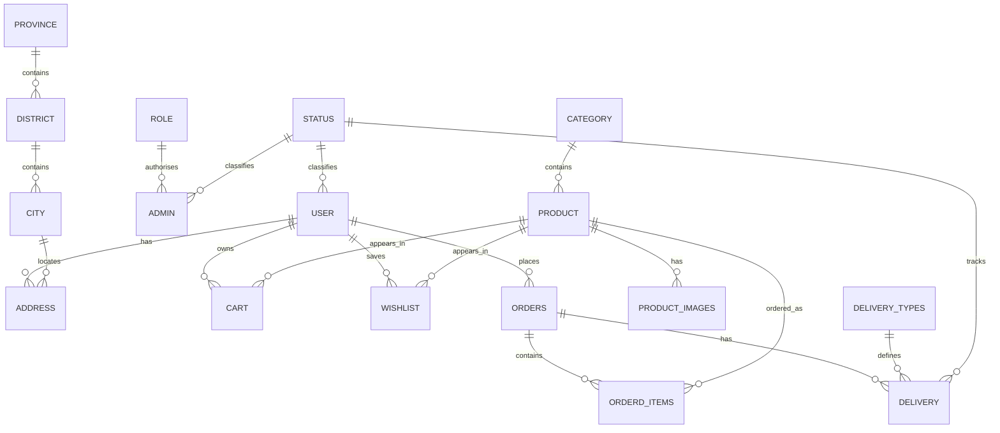

# The Furniture Store ERD

The design keeps repeating reference data separate (statuses, roles, categories and locations) and resolves the many-to-many user-product relationships through `cart` and `wishlist` tables.
